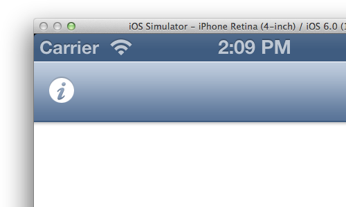
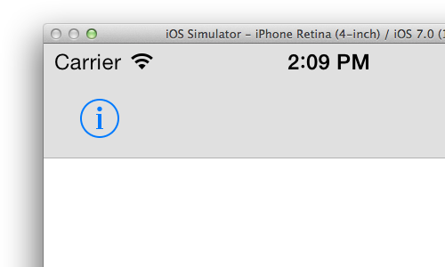
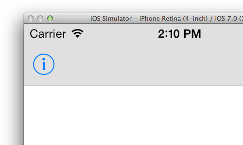

UINavigationItem-iOS7Spacing
============================

Category to fix iOS 7 UINavigationItem spacing.

leftBarButtonItem position on iOS 5/6




leftBarButtonItem position on iOS 7




Fixed leftBarButtonItem position on iOS 7



You do not have to do anything else, except include this category in your *-Prefix.pch file:

```
#ifdef __OBJC__
    #import <UIKit/UIKit.h>
    #import <Foundation/Foundation.h>
    #import "UINavigationItem+iOS7Spacing.h"
#endif
```

Fully tested on iOS 6/7.